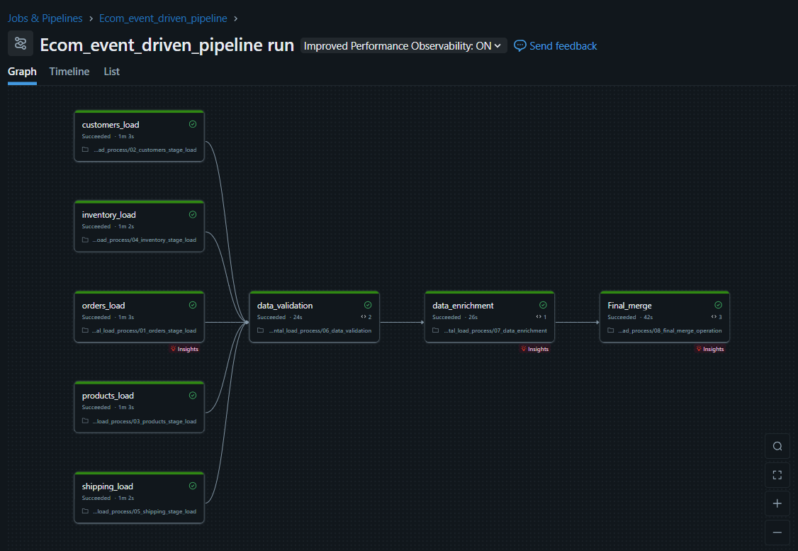
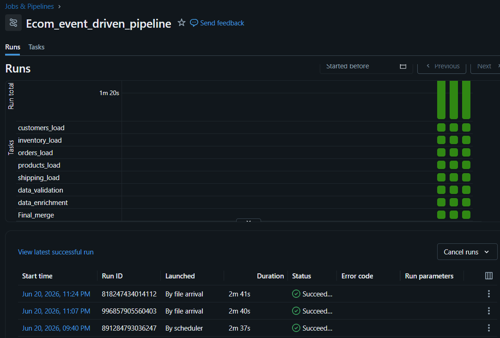
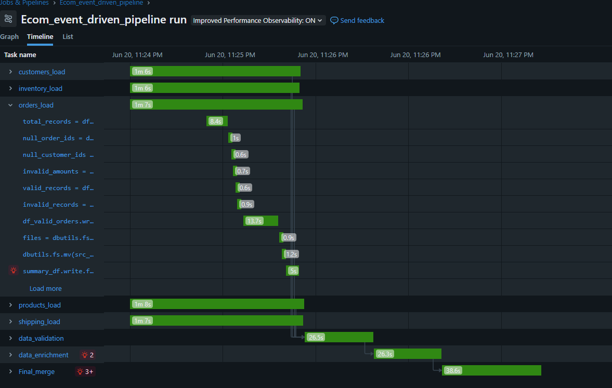
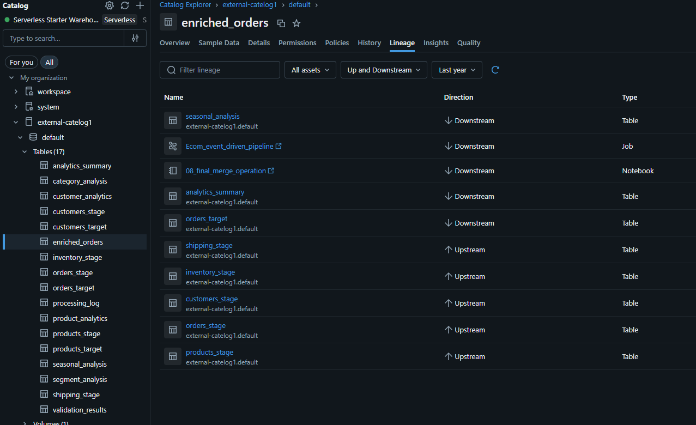
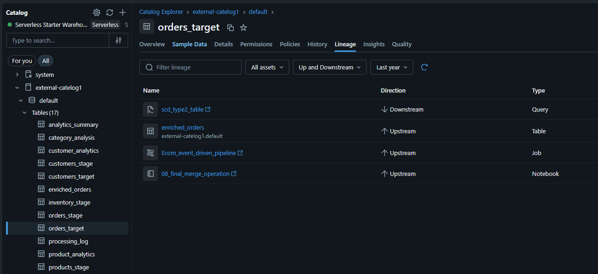
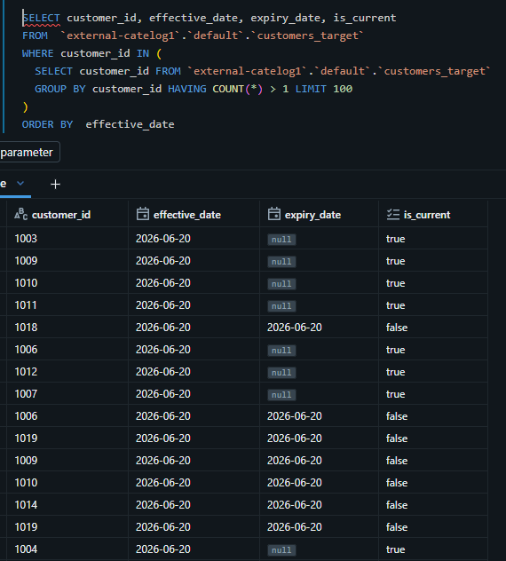
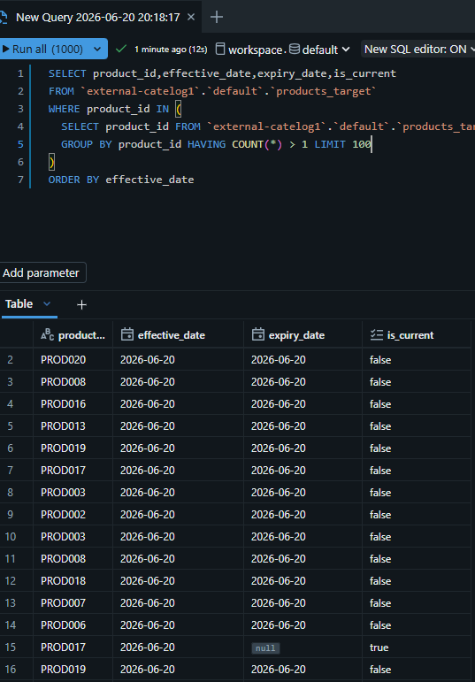
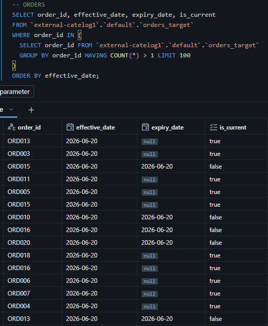
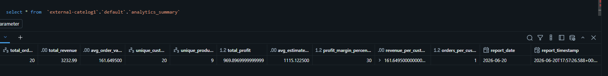
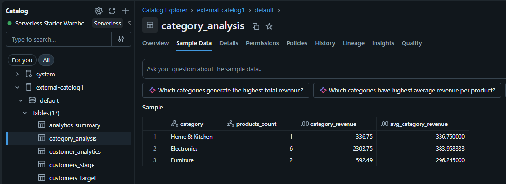

# ecommerce-event-driven-pipeline-databricks
Event-driven ETL pipeline on Databricks with SCD Type 2 dimension tracking
An event-driven ETL pipeline built on Databricks that ingests multi-source e-commerce data (customers, orders, products, inventory, shipping), validates and enriches it, and merges it into target dimension/fact tables using a Slowly Changing Dimension (SCD) Type 2 pattern — triggered automatically on file arrival, with no manual scheduling.

The pipeline is structured as a multi-stage Databricks Job with both parallel and sequential stages:

Parallel ingestion — customers_load, inventory_load, orders_load, products_load, shipping_load run concurrently, reading newly arrived files and performing initial data quality checks (null checks, invalid amount checks, valid/invalid record splitting).
Validation — data_validation consolidates and validates records across all sources.
Enrichment — data_enrichment joins and enriches the validated data (e.g. computing profit margin, estimated CLV, seasonal/time-of-day attributes).
Final merge — 08_final_merge_operation merges enriched data into target tables in Unity Catalog using SCD Type 2 logic, and writes a run summary to a processing_log table.

**Tech Stack**

Databricks (Serverless compute, Workflows / Jobs & Pipelines)
Delta Lake (MERGE, time travel, ACID transactions)
PySpark / Spark SQL
Unity Catalog (table governance, automatic data lineage)
Event-driven triggers (file-arrival based orchestration)

**Data Quality & Validation**

Each ingestion notebook performs inline data quality checks before data is allowed downstream — null checks on key fields, invalid amount detection, and splitting of records into valid/invalid sets.

Every pipeline run logs its own execution metadata (task name, status, record counts, timestamp) to a processing_log table — giving the pipeline basic self-observability.

**Data Lineage**

Unity Catalog automatically tracks lineage at the table level, showing exactly which jobs, notebooks, and upstream tables produced each target table.
enriched_orders lineage (5 upstream sources → enrichment → 3 downstream targets):

**SCD Type 2 — Dimension History Tracking**

Customer and product dimension tables track historical versions using effective_date, expiry_date, and is_current columns, so the pipeline preserves history rather than overwriting it on every change.

Customers — version history:

Products — version history:

Orders:

**A bug I found and fixed along the way**

While testing, I noticed the initial merge implementation expired and re-inserted every matching record on every single run, regardless of whether any tracked attribute had actually changed. This meant re-running the pipeline with unchanged source data still produced new "versions" — silently inflating the dimension tables with duplicate, identical rows instead of real history.

The fix: rewrote the merge logic (08_final_merge_operation.ipynb) to use Delta Lake's whenMatchedUpdate with an explicit change-detection condition — comparing a defined set of tracked columns per table — so a new version is only created when something meaningful actually changed (e.g. a customer's address, a product's price or stock status, an order's status).

Note: This fix is implemented in the notebook in this repo, but full end-to-end verification across all edge cases in the live environment is still in progress.

Business Analytics Output
The pipeline produces summarized, business-ready analytics tables as a final step — not just raw merged data.

**What This Project Demonstrates**

Designing and orchestrating a multi-stage, event-driven data pipeline (not just a scheduled batch job)
Implementing data quality checks at ingestion time, with valid/invalid record handling
Implementing SCD Type 2 dimension tracking using Delta Lake MERGE
Debugging a real data-versioning bug in production-style merge logic and redesigning it using explicit change detection
Using Unity Catalog lineage to trace data flow from raw source to business-ready output
Building basic pipeline observability via a self-logging processing_log table

